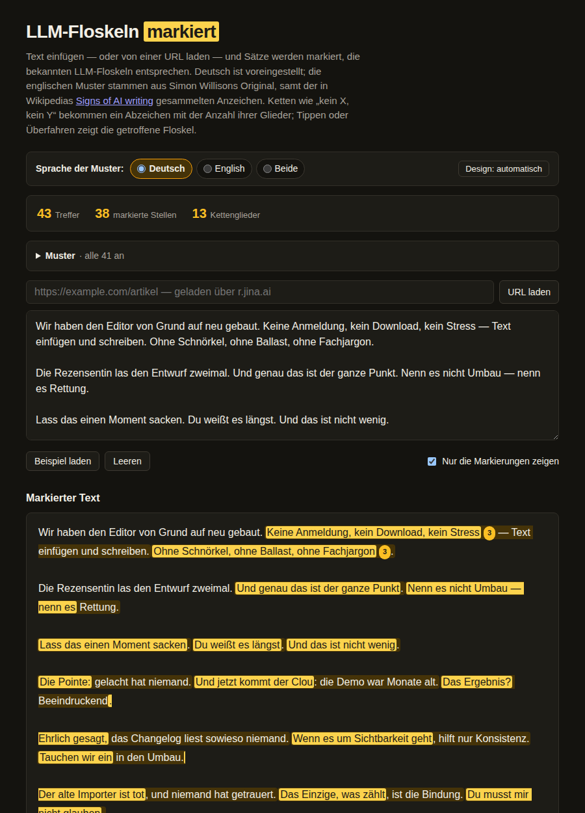

# LLM-Floskel-Marker

Markiert Sätze, die bekannten LLM-Floskeln entsprechen — **auf Deutsch, voreingestellt**,
auf Englisch oder in beiden Sprachen zugleich. Eine einzige HTML-Datei, kein Build, keine
Abhängigkeiten, nichts verlässt die Seite außer einem ausdrücklichen „URL laden".

**→ [Tool öffnen](https://aaronspring.github.io/llm-cliche-highlighter-de/)**

*In English: a German-first fork of Simon Willison's
[LLM cliché highlighter](https://tools.simonwillison.net/llm-cliche-highlighter). The
upstream English pattern set, layout and self-test harness are kept as they are; this fork
adds 41 German patterns, a language switcher (German by default), a bilingual interface,
Unicode-aware matching and a dark mode.*



## Benutzung

`index.html` im Browser öffnen — lokal per Doppelklick oder über den Link oben. Text
einfügen, die Analyse läuft beim Tippen mit. Alternativ einen Artikel per URL laden; der
Abruf geht wie im Original über `r.jina.ai`.

- **Sprache der Muster**: `Deutsch` (Voreinstellung), `English`, `Beide`. Die Oberfläche
  folgt der Auswahl; `Beide` bleibt deutsch.
- Sieht der eingefügte Text klar nach der anderen Sprache aus, bietet ein Hinweis den
  Wechsel an. Die Schätzung zählt Funktionswörter und schweigt, wenn sie unsicher ist.
- Ketten wie „kein X, kein Y" bekommen ein Abzeichen mit der Anzahl ihrer Glieder; Tippen
  oder Überfahren zeigt die getroffene Floskel.
- Text, Sprachwahl und Design landen im `localStorage` des Browsers.

## Die deutschen Muster

41 Muster in drei Gruppen:

- **Rhetorische Tics** — „Kein X, kein Y"- und „Ohne X, ohne Y"-Ketten, „Das ist der ganze
  Punkt", „Nenn es nicht X — nenn es Y", „Lass das sacken", „Du weißt es längst", „Die
  Pointe ist", „Und jetzt kommt der Clou", „Das Ergebnis? Beeindruckend.", aufgeführte
  Ehrlichkeit, „Tauchen wir ein", „X ist tot", „Das Einzige, was zählt", „Wie sich
  herausstellt", gestapelte rhetorische Fragen, wiederholte Satzanfänge, Echo-Satzketten,
  Doppelpunkt-Dreiklang, nachgestellte Negation, „Auf deiner Reise".
- **Anzeichen für KI-Text (Wikipedia)** — die Tells aus Wikipedias
  [Signs of AI writing](https://en.wikipedia.org/wiki/Wikipedia:Signs_of_AI_writing), aufs
  Deutsche übertragen: KI-Vokabular, „nicht nur X, sondern auch Y", „Es ist wichtig zu
  beachten", „ist ein Zeugnis für", „spielt eine entscheidende Rolle", „sich ständig
  wandelnde Landschaft", „Experten sind sich einig", „Trotz dieser Herausforderungen",
  nachgestellte Deutungs-Schwänze, Werbeprospekt-Ton, Zusammenfassungs-Floskeln,
  Übergangs-Floskeln, Chatbot-Reste.
- **Anglizismen & Lehnübersetzungen** — „am Ende des Tages", „das Beste aus beiden Welten",
  „macht Sinn", „auf das nächste Level", sowie verbrauchte Metaphern wie „das Rad neu
  erfinden", „der Elefant im Raum", „die Spitze des Eisbergs".

Strukturmuster (Fragenketten, wiederholte Satzanfänge, Echo-Ketten, Doppelpunkt-Dreiklang)
gibt es pro Sprache, weil sich Stoppwörter und Aufzählungs-Konjunktionen unterscheiden: die
deutsche Kettensuche nimmt `und`, `oder`, `sowie`, `noch` und `aber` als Trenner, die
englische nur `and` und `or`. Alle deutschen Regexes laufen mit `u`-Flag und
Unicode-Wortgrenzen, damit Umlaute und ß nicht an ASCII-`\b` scheitern.

Ein neues Muster ist ein Objekt mehr in `PATTERNS_DE` bzw. `PATTERNS_EN` oben im Skript —
Checkbox, Trefferzähler und Markierung kommen von selbst.

## Selbsttests

358 Selbsttests (positive und negative Fälle je Muster plus Strukturtests) laufen beim Laden
im Browser und melden sich im Fußbereich der Seite. Dieselben Tests headless:

```bash
node -e 's=require("fs").readFileSync(0,"utf8");cut=n=>s.split(`// ==== ${n} start ====`)[1].split(`// ==== ${n} end ====`)[0];eval(cut("impl")+cut("tests")+`let f=0;for(const t of selfTests){try{t.fn()}catch(e){f++;console.log("FAIL "+t.name+": "+e.message)}}console.log((selfTests.length-f)+" passed, "+f+" failed");process.exitCode=f?1:0`)' < index.html
```

Der Exit-Code ist 1, sobald etwas fehlschlägt. Dieselbe Zeile läuft in GitHub Actions bei
jedem Push (`.github/workflows/tests.yml`).

## Herkunft und Lizenz

Fork von [LLM cliché highlighter](https://tools.simonwillison.net/llm-cliche-highlighter)
von Simon Willison ([simonw/tools](https://github.com/simonw/tools)). Apache License 2.0 —
siehe [`LICENSE`](LICENSE) und [`NOTICE`](NOTICE).
